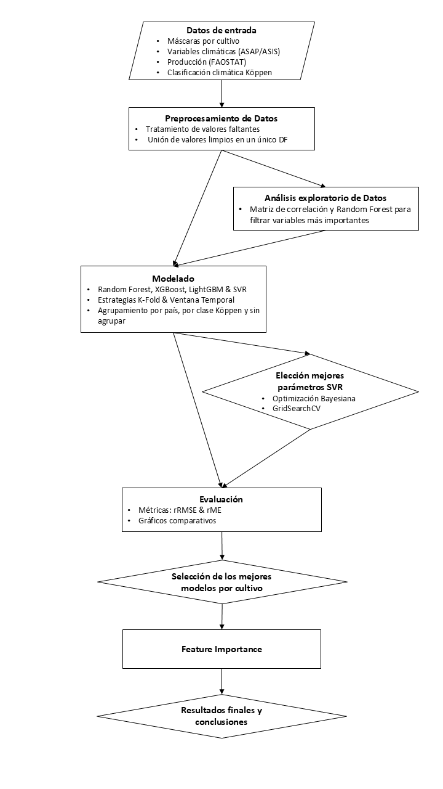

## TFG - Entrenamiento de Modelos de Predicción


---

## 📝 Descripción

Este proyecto corresponde al Trabajo de Fin de Grado de Nacor Olmos Caballero en la Universitat de València. El objetivo principal es evaluar y predecir el rendimiento de cultivos agrícolas (maíz, arroz y trigo) mediante el uso de modelos de aprendizaje automático (ML) aplicados a datos satelitales.

---

## 📂 Estructura del Proyecto

```
Proyecto/
│
├── Clean_Data/              # Archivos procesados y listos para modelado
├── Data/                    # Conjunto de datos originales
├── img/                     # Imágenes utilizadas en notebooks y documentación
├── Mejores_modelos/         # Modelos optimizados guardados con joblib
├── Resultados/              # Resultados exportados por cultivo y modelo
│
├── datos.ipynb              # Análisis exploratorio y limpieza
│── modelos.ipynb            # Entrenamiento y evaluación de modelos
│── visualizacion.ipynb      # Visualización de métricas y resultados
├── requirements.txt         # Dependencias del proyecto
└── README.md                # Este archivo
```

---

## ⚙️ Tecnologías Utilizadas

- Python (v3.13.2)
- Scikit-learn
- XGBoost
- LightGBM
- Seaborn / Matplotlib
- SHAP
- Rasterio / Rasterstats
- Jupyter Notebook

---

## 📊 Metodología

Se emplearon dos enfoques de validación:

- **K-Fold por país**
- **Validación por ventana temporal**

Se entrenaron y evaluaron modelos como:

- Random Forest Regressor  
- Support Vector Regressor (SVR)  
- XGBoost  
- LightGBM  

Para cada modelo y cultivo, se analizaron las métricas:
- rRMSE (root Relative Mean Square Error)
- ME (Mean Error)

---

## Diagrama de flujo

El siguiente diagrama representa el flujo completo del trabajo realizado, desde la recopilación y procesamiento de datos hasta la evaluación y visualización de los resultados.



---

## 📌 Cómo empezar

1. Clona el repositorio o descarga el proyecto.
2. Instala las dependencias:

```bash
pip install -r requirements.txt
```

3. Abre los notebooks en el siguiente orden:
   - `datos.ipynb`
   - `modelos.ipynb`
   - `visualizacion.ipynb`

---

## 📎 Notas adicionales

- Los datos de entrada deben estar preprocesados correctamente antes de ejecutar los modelos.
- Algunos modelos requieren una GPU o CPU potente, especialmente LightGBM y XGBoost con muchos parámetros.
- Para reproducir exactamente los mismos resultados, asegúrate de fijar las seeds (`random_state`).

---

## 📬 Autor

**Nacor Olmos Caballero**  
Universitat de València  
Tutores: Jordi Muñoz Marí & María Piles Guillem

---

## 📷 Créditos

- Logo: Universitat de València  
- Datos satelitales: ASAP (Anomaly Hotspots of Agricultural Production) & FAO-ASIS (Agriculture Stress Index System)